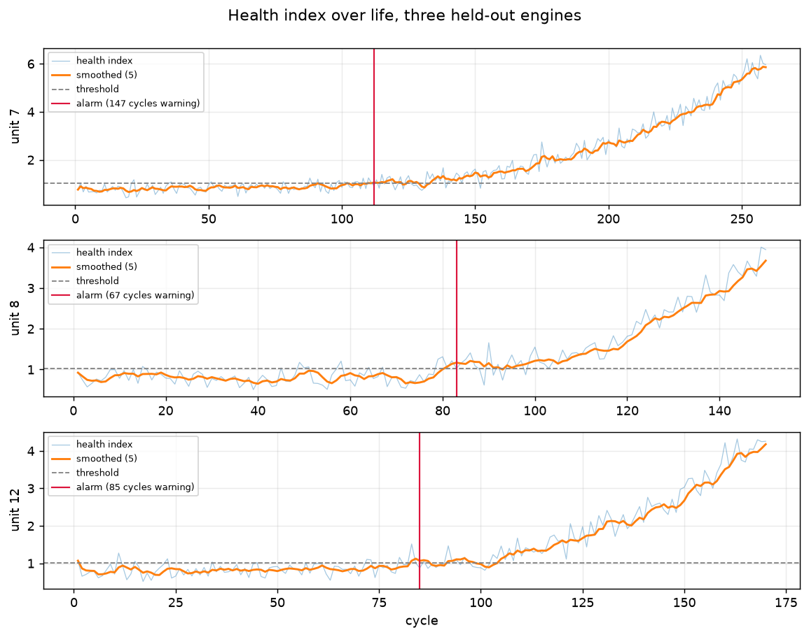
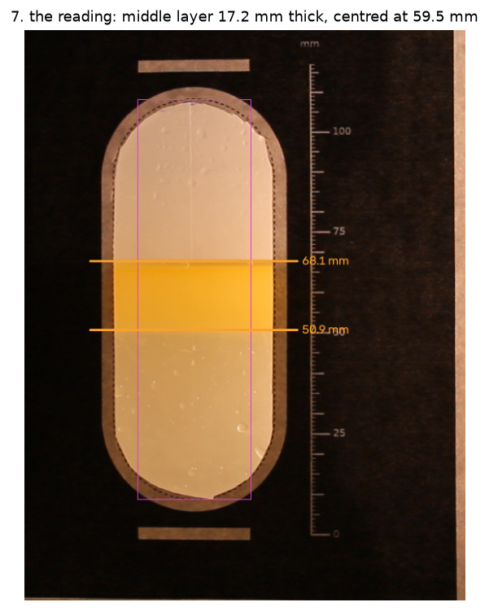

# Process monitoring and machine vision

Two projects reading machine condition, one from sensors and one from a camera.

## process-anomaly-detector

Detects turbofan engines going bad before they fail, on NASA C-MAPSS data: 100
engines, 21 sensors, every engine run until it failed.



A health index built from each engine's own healthy baseline gives about 100
flights of warning on engines it has never seen, catches all of them, and
raises no false alarms. PCA monitoring and Isolation Forest are measured
against it over ten random splits, using the same code and the same threshold
rule, and land within noise of it.

**[Write-up, method and results →](process-anomaly-detector/README.md)**

## interface-level-vision

Reads a liquid-liquid interface level from a camera: a jar of water and oil on
a desk, read through a window shaped like the sight glass on a solvent
extraction settler.



A printed mask gives the scale and the calibration. Checked against a hand
reading, and across five different lightings and ten repeat shots.

**[Write-up, method and results →](interface-level-vision/README.md)**

## Running them

Each project has its own tools and its own `Running it` section in its README.
One pixi environment covers both.

```powershell
pixi install
cd process-anomaly-detector\notebooks
pixi run python 01_explore.py
```

The scripts use `# %%` cell markers so they open as notebooks in VS Code, but
they are ordinary Python files and run from the command line. Plots open in
windows; set `HEADLESS=1` to write them to `figures/` instead.

The C-MAPSS data is not in this repo; `process-anomaly-detector/README.md` says
where to get it.

## Licence

MIT, see [LICENSE](LICENSE).
