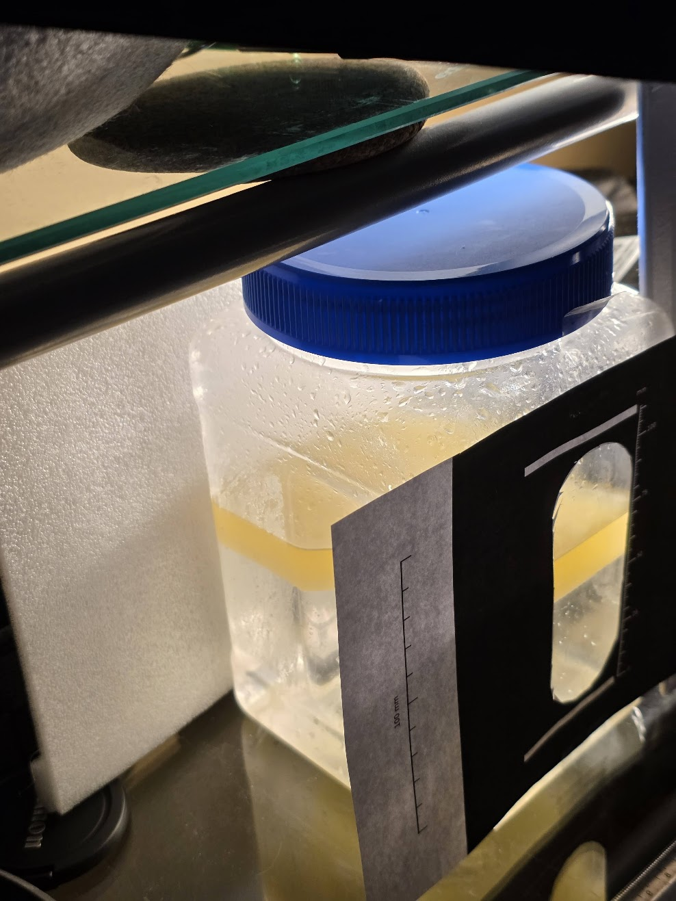
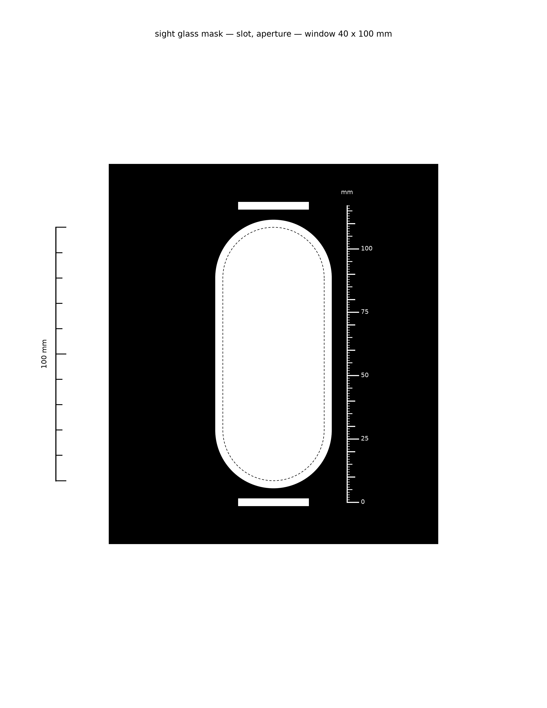
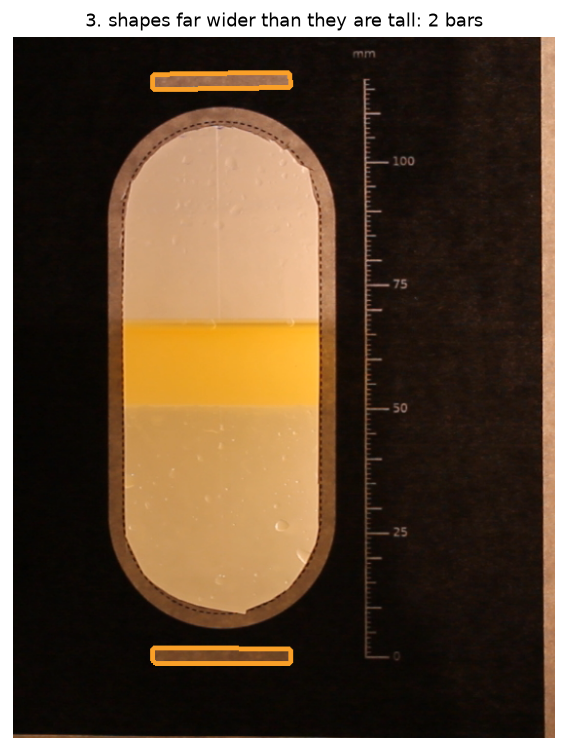
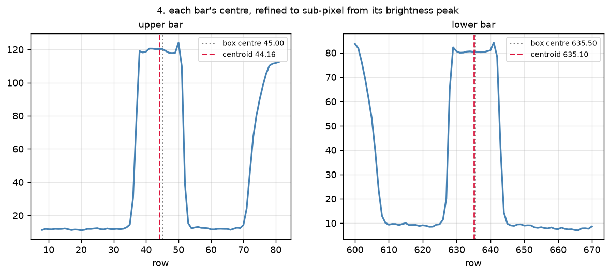
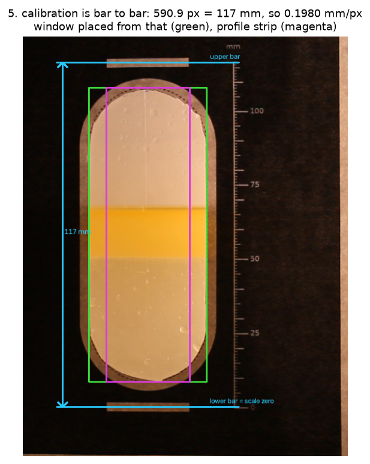
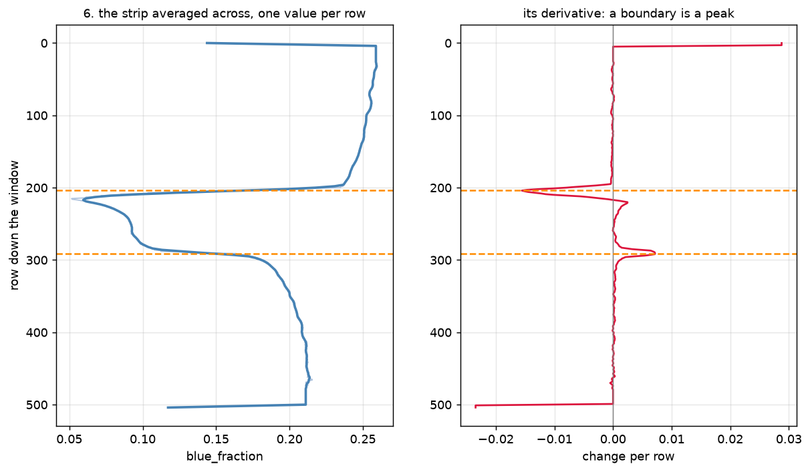
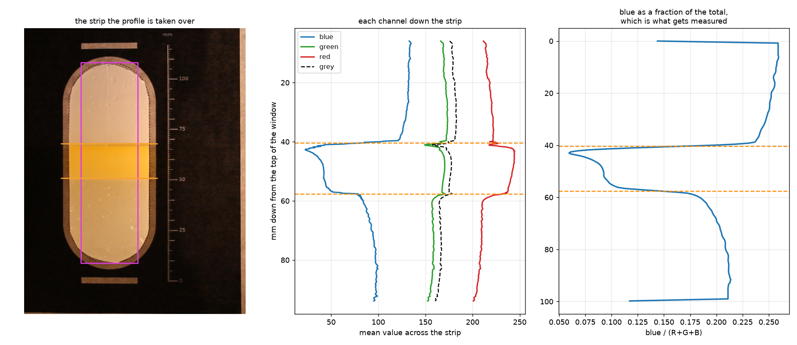
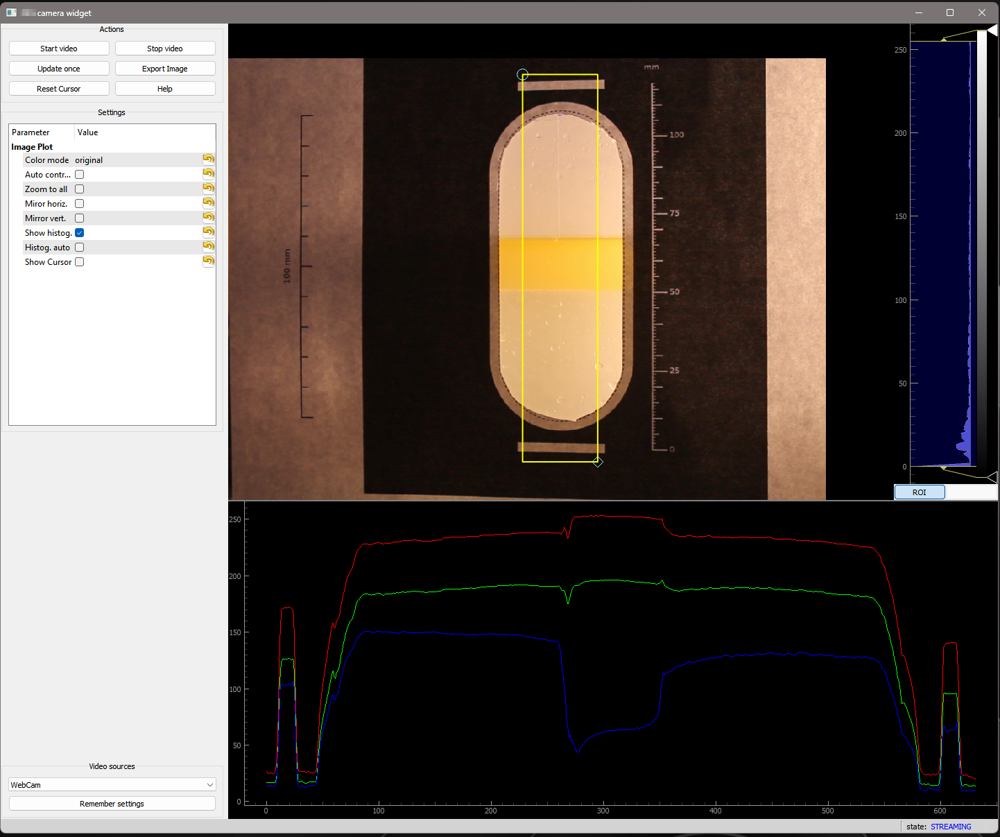
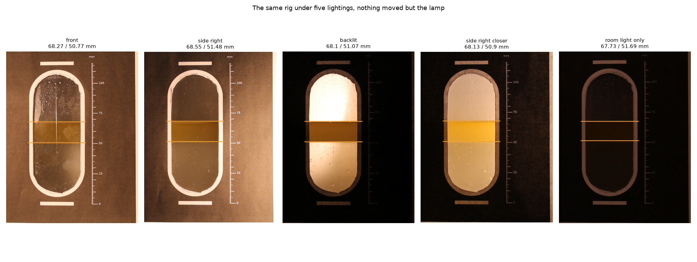
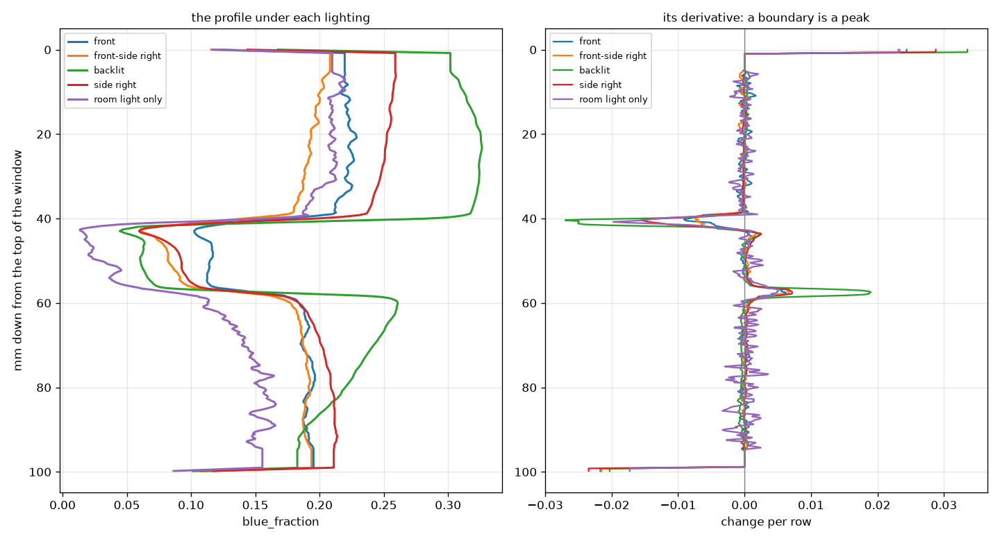

# Reading a liquid interface from a camera

Machine vision reading the level of a liquid-liquid interface: a jar of water
and oil on a desk, three layers and two boundaries, read through a window
shaped like a flat glass level gauge.

In a settler the layers are aqueous solution, crud and organic solvent. On the
bench they are water, oil and air.

**Stack:** Python, OpenCV, NumPy, matplotlib.

---

## The rig

A square jar with flat faces, holding water, a thick layer of oil, and air. The
oil layer is thick so the two boundaries stay far enough apart to be told from
each other. Where a crud layer is thin the two merge, and the code reports a
single interface.

A printed mask is taped over the front face: an opaque surround, an obround
window, a white ring around the opening, two calibration bars and a numbered
scale. `tools/make_sight_glass_mask.py` prints it and every dimension is an
argument.




**The bars carry the scale.** Their centres are a printed 117 mm apart, so the
distance between them in pixels gives millimetres per pixel out of the image
itself, and the scale survives the camera being moved or re-zoomed.

**The bars are narrower than the window,** so a strip the width of a bar runs
down inside the opening without reaching the rim.

**The numbered scale is zeroed on the lower bar,** the same datum the detector
uses, so a reading by eye and a reading by machine can be compared directly.

The marks put known features in the scene, so the vision system has less to
figure out on its own: they give it the scale, the datum, and where to look. A
real vessel can carry the same helpers, markings, a ruler, dots on the wall.

## Finding the window

`tools/show_stages.py` writes a picture for every step.

**Find the bars.** Threshold each pixel against the mean of its own
neighbourhood, then keep the shapes far wider than they are tall.



**Refine each centre** to sub-pixel, as a brightness-weighted centroid across
the rows above half the peak height.



**Place the window** from the bars. Its position relative to them is printed, so
there is nothing to search for.



Cyan is the 117 mm baseline, green the window, magenta the strip the profile is
taken over.

## Reading the level

Average the strip across, one value per row. A boundary is a step in that
profile, and a step is a peak in its derivative.



Which channel gets profiled decides how well this works. Each step below is
given as a percentage of its own profile's range, so the comparison is scale
free:

| channel | oil to air | oil to water |
|---|---|---|
| grey | 2.48% | 0.62% |
| green | 2.47% | 0.70% |
| red | 0.01% | 1.54% |
| blue | **8.46%** | 3.17% |
| **blue over (R+G+B)** | 7.79% | **3.59%** |



The oil is yellow, so blue drops through it while red barely moves. The two
liquids are close in brightness and far apart in colour. The default is blue as
a fraction of the total, since a ratio holds still when the lighting changes.

This was easy to see live while exploring the scene with a camera widget I
wrote at the Canadian Light Source in 2022, built on pyqtgraph. Its
region-of-interest tool plots red, green and blue as the camera streams.



Blue drops from about 150 to 15 through the oil there too. The pipeline here
runs without the widget.


## The pipeline, in order

| step | method |
|---|---|
| find the calibration bars | adaptive threshold, morphological opening, filter on elongation and fill |
| refine each bar's centre | brightness-weighted centroid above half the peak height |
| place the window | linear placement from the bar centres and their separation, using the printed geometry |
| find the opening, if the bars are not available | adaptive threshold, morphological closing and opening, convex hull, shape matched against an obround by extent |
| build the profile | strip average, one row at a time, in the blue-over-total colour ratio |
| smooth it | rolling mean, edges carried outward rather than filled with the mean |
| find the boundaries | first derivative, peak picking with an edge margin and a suppression window |
| convert to millimetres | printed scale, zeroed on the lower bar |
| check the scale | bar separation against bar length, two independent estimates |

## The same rig under five lightings

Nothing touched between shots except the lamp.



| lighting | upper mm | lower mm | layer mm | centre mm | upper step | scale check |
|---|---|---|---|---|---|---|
| front | 68.27 | 50.77 | 17.50 | 59.52 | -0.0091 | 0.84% |
| front-side right (45°) | 68.55 | 51.48 | 17.07 | 60.01 | -0.0075 | 0.67% |
| backlit | 68.10 | 51.07 | 17.03 | 59.58 | **-0.0270** | **0.09%** |
| side right (90°) | 68.13 | 50.90 | 17.23 | 59.52 | -0.0156 | 1.10% |
| room light only | 67.73 | 51.69 | 16.04 | 59.71 | -0.0198 | 0.06% |

| measurement | range | standard deviation |
|---|---|---|
| upper boundary | 0.82 mm | 0.30 mm |
| lower boundary | 0.92 mm | 0.39 mm |
| **layer centre** | **0.49 mm** | **0.21 mm** |
| layer thickness | 1.46 mm | 0.55 mm |



The layer centre is the steadiest of the four and the thickness the least
steady, 0.21 mm against 0.55 mm: the centre averages the two boundary errors and
the thickness adds them.

Backlighting gives the strongest steps and the best scale check, and it needs a
window on the far side of the vessel, which most plants will not have. The 90°
side light, entering across the interface rather than along the camera's own
line of sight, gives the clearest image of the rest, but it needs a window on
the side of the vessel, which is no more given than one at the back. The
walkthrough figures earlier on this page are from that 90° side light. Front and
front-side lighting need no window beyond the one the camera already looks
through, which makes them the two a plant is actually likely to have.

Room light only is barely readable by eye and landed within half a millimetre of
the rest.

Between the mask and the choice of channel, none of this needed a neural
network.

Across all five lightings the reading stayed within about a millimetre, without
retuning anything. That is not licence to change the lighting mid-run: a change
shifts the reading while it happens, so the light should be set once and left
alone.

## The scale checks itself

Millimetres per pixel comes out twice, once from the distance between the bar
centres and once from the length of a bar. Them disagreeing means something is
wrong.

It caught a real one. On a front-lit frame the two disagreed by 7.2% where a
good frame gives 0.7%. The sub-pixel refinement had run off a bar into the white
ring 4 mm away, which front lighting made brighter than the bar, and dragged
that bar's centre 26.8 px. It now refuses to move a centre more than half a bar
thickness.

## Limits

**Verified down to the millimetre.** Read by eye against the printed scale, the
readings agree with it.

**The camera sits slightly above the liquid,** so a boundary images as a band a
few millimetres deep rather than a line and the detector picks a row out of it.
The bars repeat to a fraction of a pixel and the boundaries to about a
millimetre, so that is where the millimetre comes from.

**A jar is not a settler.** No flow, no moving interface, and a clean band
rather than an emulsion that has to be judged.

**Held the lighting fixed and shot ten frames.** Nothing touched between shots
but the shutter. Nine of the ten agreed to two decimal places; the tenth was
0.4 mm off. Standard deviation came out at 0.13 mm on the upper boundary and
0.00 mm on the lower one, against 0.30 and 0.39 mm across the five different
lightings, so most of that earlier spread was the lighting changing rather than
the detector guessing differently on an unchanged scene.

**Resolution and field of view are tunable.** These frames give roughly a fifth
of a millimetre per pixel, which is stable enough for most uses under steady
lighting. A narrower field of view or a higher-resolution camera puts more
pixels across the same span, for anyone who needs tighter than that. Where to
land on that trade-off is a question for the actual measurement requirement.

## Running it

```powershell
pixi install
pixi run python tools/make_sight_glass_mask.py      # print the mask
pixi run python tools/capture.py --out frame.png
pixi run python tools/crop_to_gauge.py frame.png
pixi run python tools/try_measure.py frame_cropped.png
pixi run python tools/show_stages.py frame_cropped.png
pixi run python tools/show_channels.py frame_cropped.png
```

For a lighting series, `tools/lighting_trial.py --label "side right"` captures,
measures and appends a row, and `tools/lighting_report.py` turns the rows into
the comparison above.

## What's next

This demo reads the level once per frame and prints the result. The next step
in a real control system is publishing that reading as a process variable: an
operator screen can show it, an alarm can trigger off it, a historian can log
it, and a trend chart can plot it live. It's a typical pattern in EPICS, or
any other SCADA system.

A live version is the natural extension: read continuously, publish the two
boundary heights as they come in, and plot them updating in real time.
