# Catching machine degradation before failure

This project detects turbofan engines going bad before they fail, using only
their sensor readings, which is the same job as condition monitoring on a pump
or an agitator in a plant. The data is NASA C-MAPSS: 100 simulated engines, 21
sensors recorded every flight, and every engine run until it failed.

I started with the simplest detector that could work, and only added anything
more complicated when the data showed the simple one was leaving something out.

**Data:** NASA C-MAPSS, subset FD001 (100 engines, sea level, HPC degradation).
**Stack:** Python, pandas, NumPy, scikit-learn, matplotlib.
**Scripts:** `notebooks/01` through `10`, run in order.
**Short version:** [WHAT_WE_DID.md](WHAT_WE_DID.md) covers the idea behind each
step in plain language, without the numbers.

---

## What the sensor data contains

Six of the 21 sensors never change, but they are not broken instruments: they
are ambient conditions and commanded setpoints, and FD001 holds the operating
condition fixed at sea level with a single throttle setting, hence they cannot
move. A seventh sensor does move, but it has no relation to wear, so movement
on its own does not make a sensor useful.

The remaining 14 sensors trend with remaining life. I measured that inside each
engine first and then took the median over all 100, because pooling the engines
together would have mixed up two different things: an engine that is worn, and
an engine that was always somewhat different from the rest.

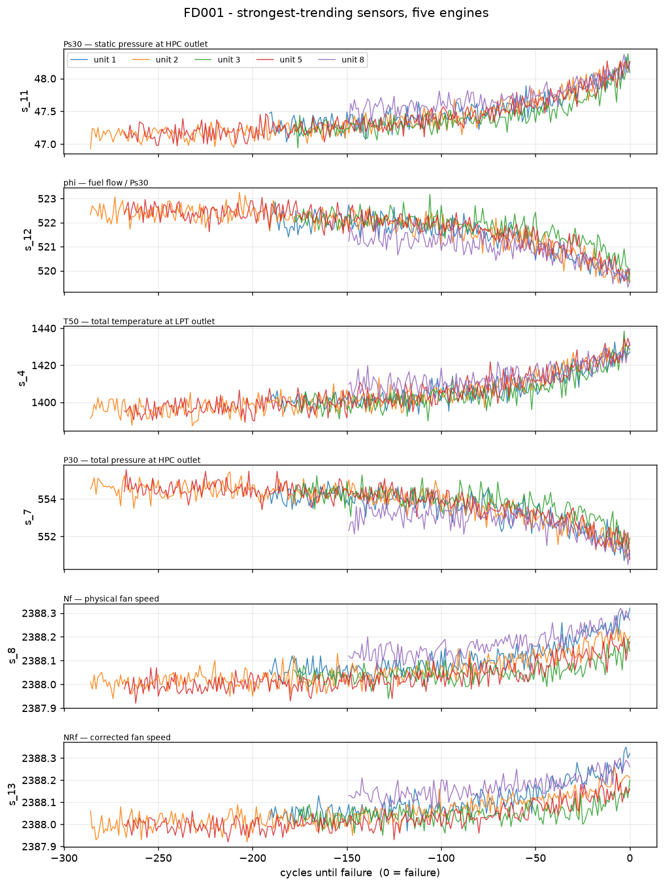

Failure is at the right edge of each panel, and three things in this figure
determine everything that follows. The drift starts about 100 flights before
failure and gets steeper towards the end, hence there is time to catch it. The
engines start apart and end up together, which means a fixed threshold across
the fleet would catch failure late, and each engine has to be compared against
its own early life instead. Finally, the noise on each sensor is a large
fraction of the drift, so nothing can alarm on a single reading, and everything
below is smoothed over five flights and requires three flights in a row above
the alarm level before it trips.

## Why there are no main components in healthy data

The sensors are correlated with each other, but only once wear has started. In
healthy data alone they are effectively independent: the eigenvalues of the
healthy covariance all sit inside the range that pure sampling noise produces,
while over a full life a single direction carries 62.5% of the variance.

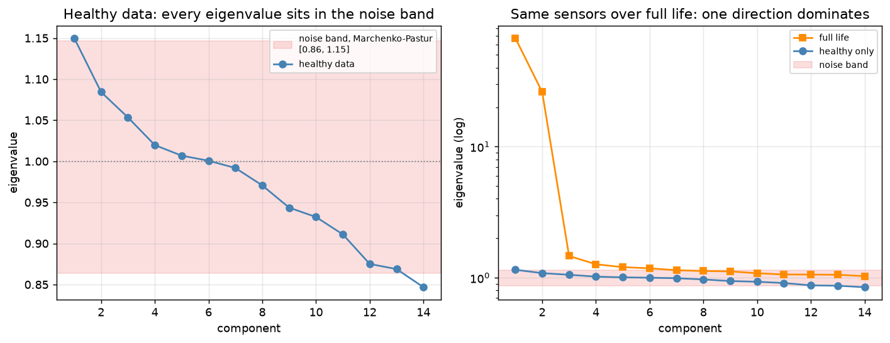

This matters for what follows, because PCA monitoring works on the assumption
that healthy data has a shape, meaning sensors that move together, and that a
fault shows up when that shape breaks. Here the healthy cloud of readings is a
ball, and when it is a ball, "does not fit the shape" means the same thing as
"far from the middle", which is what a simple distance already measures.

The direction that does carry the variance over a full life is the fault
signature itself: core speed up, turbine outlet temperature up, HPC discharge
pressure up, fuel flow ratio and coolant bleeds down. That is a worn compressor,
which gives less pressure rise per revolution, hence the core has to spin faster
to hold thrust and everything downstream runs hotter. Airlines watch exhaust gas
temperature margin for the same reason.

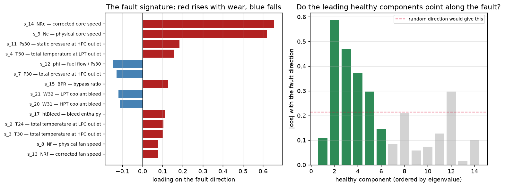

The signature also checks itself, since every loading sign comes out opposite to
that sensor's correlation with remaining life, which was measured earlier with a
completely different calculation.

## The three approaches I compared

All three are fitted on healthy flights only, which is the situation in a plant
where there is plenty of running-fine data and almost no labelled failures. They
all get the same inputs, the same smoothing and the same scoring code, and the
engines are split whole into training and held-out sets, never by row.

Each engine's first 40 flights define its own normal, one mean and one spread
per sensor, and every later reading is then expressed as how many of its own
normal wobbles it sits away from that. The three approaches differ only in what
they do with those 14 numbers.

**The health index** averages them, which gives one number per flight: how far
this engine is running from its own normal. There is no fitting and nothing to
maintain, and an operator can be told what it means in a single sentence.

**PCA monitoring** learns the directions healthy data varies in, and then flags
readings that either travel too far along those directions (T²) or in directions
the healthy data never used (Q).

**Isolation Forest** grows trees from the healthy data using random cuts, and
scores a reading by how few cuts are needed to isolate it, since a reading in a
sparse neighbourhood gets isolated quickly.

Since that one is the least transparent of the three, it is worth opening up in
two dimensions.

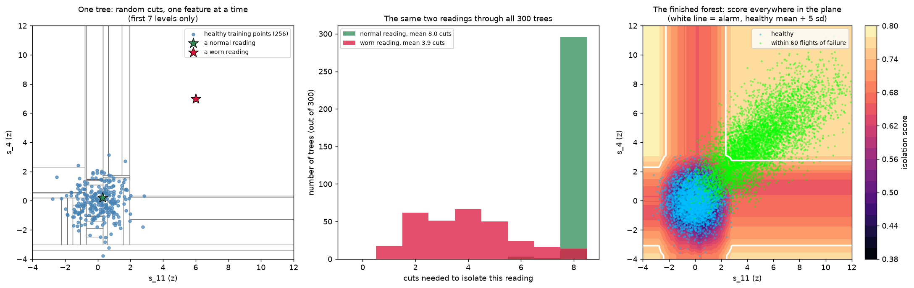

The 300 trees are built once from the healthy data and never touched again, and
a new reading is simply dropped through them: it follows the splits that were
already decided and the depth it lands at is recorded. Nothing is rebuilt and
readings do not join the training set. A normal reading buried in the cloud
needs 8 cuts on average, a worn one out in the empty region needs 3.9.

The middle panel also shows where the ceiling on the score comes from. With 256
samples per tree the depth cap is log2(256) = 8, and the normal reading's
histogram is a single spike sitting on it, hence path length lives between 1 and
8 and the score between about 0.38 and 0.80. That bound is a property of the
method, and it is what makes the score saturate near failure further down.

The third panel scores the whole plane, with the alarm put where the rest of the
project puts it, namely the healthy mean plus 5 standard deviations, that being
the smallest margin leaving no healthy reading above the line. The green cloud
straddles the line rather than sitting outside it, since 65% of the readings
within 60 flights of failure are above it, running from 29% at 60 flights out to
98% in the last 15. This is two sensors out of fourteen scoring single readings
with no smoothing, hence a much weaker test than the results table reports, where
all fourteen are averaged, smoothed over five flights and required to stay above
the line for three flights in a row. The alarm also lands at 0.74 against the
0.80 ceiling, which is the bound from the middle panel turning up as a practical
limit on how much room the detector has to work in.

The score map also has four bands of low score running out along the sensor
axes, and they are worth chasing down, since a band of low score in empty space
means readings out there are being called ordinary.

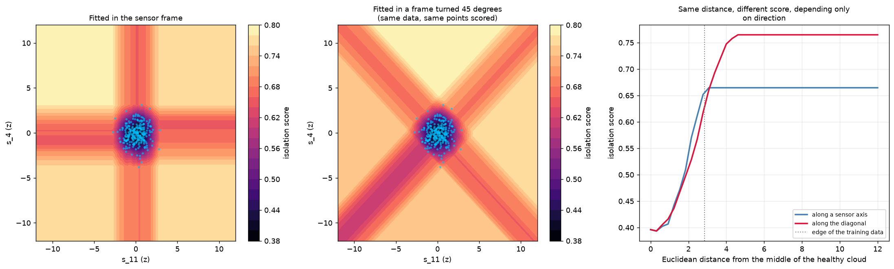

The test is to rotate the data by 45 degrees, fit a second forest on the rotated
copy, and rotate its score map back for display, hence the cloud is identical in
both panels and the same points are being scored. The bands turn with the frame,
which means they cannot be a property of the engines. Scored by the first forest
the reading at (6, 7) gets 0.765 and scored by the second it gets 0.704, where a
rotationally invariant detector would return the same number twice, and that gap
is about one standard deviation of the healthy scatter.

The third panel measures the cost along two rays leaving the middle of the
healthy cloud at the same speed. Along the diagonal the score settles at 0.765
and along a sensor axis it settles at 0.665, hence direction alone is worth 0.10
of score at every distance past the edge of the training data.

That flat 0.665 also answers whether one lucky split isolates an extreme reading
quickly, since the score is identical at 3 standard deviations out and at 1000.
Scikit-learn draws each split threshold uniformly between the smallest and
largest value in the node, and the node only ever holds training points, hence
no threshold can be placed between the healthy cloud and a reading sitting
outside its range. Every split on that sensor sends the reading the same way and
it inherits the path length of whichever training region it lands in.

This is the limitation Extended Isolation Forest was built to fix, by cutting
with randomly oriented hyperplanes instead of one feature at a time, and it
would be the first thing to try on this data.

It also fixes how the comparison should be read. Nothing in the forest was
designed to catch sensors moving together. What is true is narrower, namely that
with axis-aligned cuts a fault moving several sensors at once lands in a corner
of the healthy cloud where cuts on every axis help isolate it, while a fault
moving one sensor lands in a slab where only one axis helps. The C-MAPSS fault
is the first kind, hence the forest keeps up here, and that is a fact about this
fault rather than a virtue of the method.

The alarm level is set the same way for all of them: the healthy mean plus k
standard deviations of that detector's own score, using the smallest k that
raises no false alarm on the training engines. It has to be measured in units of
each score's own healthy scatter, because a multiplicative margin is not
scale-free and would not compare them fairly: the Isolation Forest score is
bounded and can only reach about 1.4 times its healthy level, while the squared
index is unbounded and reaches 157 times.


Where exactly to set that level is a judgement rather than a calculation, since
a lower threshold buys warning at the cost of false alarms.

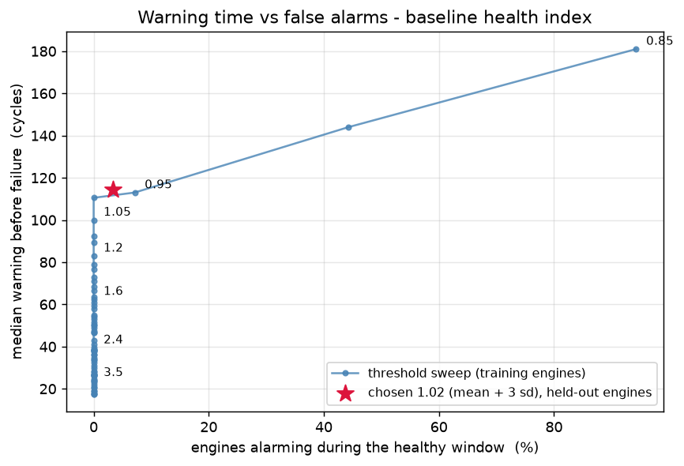

### Results

Ten random splits of the engines, 30 held out each time, and warning measured in
flights before failure.

| approach | warning | worst 10% | engines found | false alarms |
|---|---|---|---|---|
| Health index | 99.2 ± 9.9 | 71.6 | 100% | 0% |
| Squared index | 99.7 ± 9.3 | 70.2 | 100% | 0% |
| PCA T² | 102.2 ± 7.1 | 73.1 | 100% | 0% |
| PCA Q | 78.0 ± 12.1 | 46.1 | 100% | 0% |
| Isolation Forest | 99.4 ± 9.7 | 70.9 | 100% | 0% |

Four of the five give the same answer, at around 100 flights of warning with
every engine caught and no false alarms, and they are separated by 3 flights
against a split-to-split spread of 7 to 12. With 30 engines per split,
differences that size cannot be told apart, hence choosing between those four on
warning time alone would be reading noise.

PCA Q is the exception and it is a real difference, 20 flights worse and with a
considerably worse worst case, which follows from the eigenvalues: Q measures
movement in directions the healthy data never used, and since the healthy data
here has no preferred directions, there is nothing coherent for Q to be the
residual of.

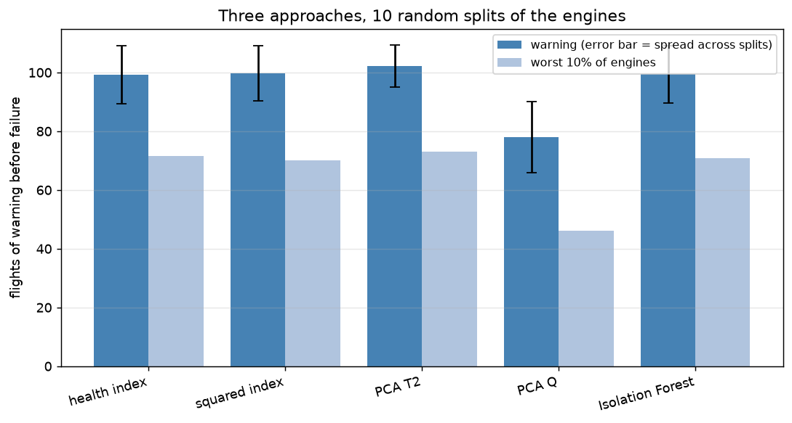

The number of PCA components cannot be chosen honestly here either, since the
scree elbow, cumulative variance and eigenvalue-greater-than-one rules all need
eigenvalues that differ from each other and these run 1.15 down to 0.80.
`notebooks/03` sweeps it and `notebooks/04` repeats the whole comparison across
splits, with the component count picked on the training engines each time.

Warning time on its own also hides things, so I measured two more properties of
each detector, namely how often the alarm drops out and comes back, and how much
the score wanders while the engine is still healthy.

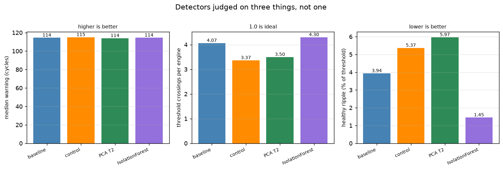

Every detector crosses its alarm level between two and four times per engine,
hence the alarm drops out and comes back on all of them, and none is ready for a
control room without a hysteresis rule.

## What the scores do after the alarm

Since warning time cannot separate the detectors, what distinguishes them is
what their score does once it has crossed the alarm, which is what matters for
ranking machines by severity rather than only knowing that something is wrong.

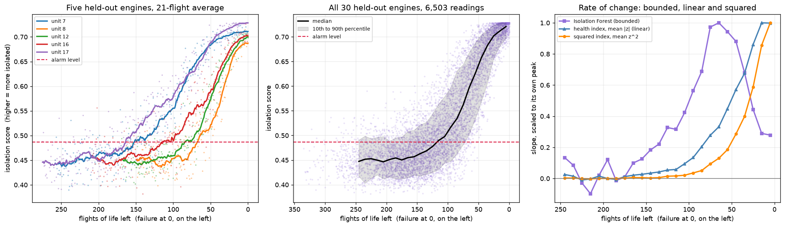

The Isolation Forest score rises smoothly from about 0.45 while healthy to about
0.72 near failure, and then flattens, because path length in a tree cannot
shrink below a single split. The third panel separates the detector from the
engine: the forest's slope peaks 65 flights before failure and falls away, while
the two unbounded scores are still climbing at the end, hence the flattening
belongs to the detector.

Plotting the three scores in their own units makes the size of the difference
plain.

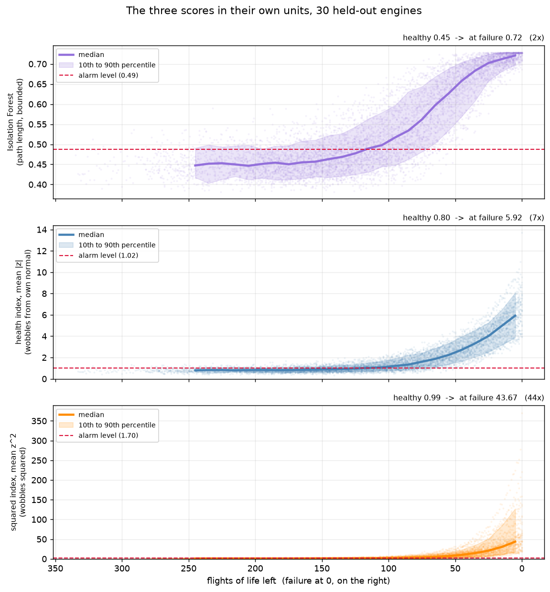

| score | healthy | at failure | growth |
|---|---|---|---|
| Isolation Forest | 0.45 | 0.72 | 2x |
| Health index, mean \|z\| | 0.80 | 5.92 | 7x |
| Squared index, mean z² | 0.99 | 43.67 | 44x |

They alarm at much the same time and then behave completely differently. The
percentile bands say the same thing: on the forest the band narrows near failure
as every engine converges on the ceiling, while on the squared index it fans out
from about 20 to over 150, and that spread is real information about which
engine is worse.

## Telling an operator that failure is close

The alarm says something is drifting, about 100 flights out. The question a
plant asks next is whether the machine can wait until the next shutdown, so it
is worth asking the data directly how much life is left given the score right
now.

Reading the numbers below needs the scale. The index is the average of |z| over
the 14 sensors, hence a healthy engine reads 0.798 rather than zero, since
taking the absolute value folds the scatter onto one side and the mean absolute
value of a standard normal is sqrt(2/pi). An index of 5 therefore says the
average sensor is 5 standard deviations from where that engine ran when new, and
it does not say every sensor is. In this data they are all elevated together but
not equally, and readings near 5 have per-sensor averages running from 3.0 on
HPC outlet temperature up to 8.9 on corrected core speed, with the two core speed
measures leading, which is the same fault signature the PCA loadings gave. An
average cannot tell a uniform drift from a lopsided one, so the per-sensor z
values are worth keeping alongside the index, since the index says something is
wrong and the individual z values say what.

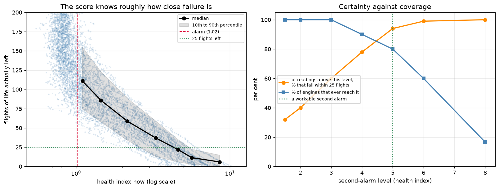

| health index | median life left | 10th to 90th | fails within 25 |
|---|---|---|---|
| 1.0 to 1.2 | 111 | 75 to 155 | 0% |
| 1.7 to 2.6 | 59 | 34 to 89 | 3% |
| 2.6 to 4.0 | 37 | 13 to 59 | 26% |
| 4.0 to 5.2 | 22 | 6 to 35 | 60% |
| 5.2 to 6.1 | 12 | 3 to 23 | 93% |
| 6.1 to 11.0 | 6 | 1 to 15 | 99% |

A second alarm at 5 is the usable compromise: of the readings above it, 94%
belong to an engine that fails within 25 flights, and 24 of the 30 held-out
engines reach it before failing. Raising it to 6 makes the first number 99% and
drops the second to 18, hence the cost of being more certain is engines that
fail without ever giving the second warning.

What this does not give is a number of flights. Just above 5 the median is about
12 flights while the range runs from 3 to 23, so "act now" is reliable and "you
have twelve flights" is not. Detection and imminence are answerable from this
data, remaining-life prediction is not.

## What I would put in a plant

**The health index.** It performs the same as everything else here, and it has
no fitting, no model to maintain, no component count to choose, and one sentence
of explanation for an operator: this engine is running further from its own
normal than it ever did when it was healthy. When the simplest option performs
as well as the alternatives, it is the one to run.

Three things would change that. More than one operating condition, because
FD001 fixes the throttle setting at sea level and varying it means the
per-engine baseline no longer refers to a single thing. More than one fault
mode, because with a single failure mode drift in any direction means the same
thing, while with several you want to know which one and a single distance
cannot tell you. And a well-instrumented process with genuine correlations
between sensors, since that is the case PCA was built for.

One parameter mattered more than the choice of method, namely the baseline
window that defines normal for each engine. At 20 flights the per-engine
estimates are noisy enough to cost roughly 10 flights of warning, and at 40 they
are not. That deserved more attention than the detector did.

## Limits

This is detection and not remaining-life prediction, so it says that something
is drifting and roughly when it started, not how long is left. The healthy
window is a convention rather than ground truth, since C-MAPSS does not label
fault onset. Every detector chatters, and the hysteresis rule that would fix it
is not implemented here.

Nothing here catches a single instrument going bad on its own. With one sensor
reading 12 standard deviations out and the other 13 normal, the Isolation Forest
score is 0.411 against an alarm of 0.588, and it stays at 0.411 whether that
sensor reads 12 or 100, hence it never alarms at any magnitude. The health index
divides the excursion by 14 and needs 15.4 standard deviations on one sensor
before it clears its alarm, so it gets there eventually and the forest does not
get there at all. The two miss it for different reasons, since the health index
averages 14 numbers and dividing by 14 is arithmetic, while the forest is
showing the axis bias measured above. A plain per-sensor limit check is what
catches that case and it should run alongside either of them.

The alarm level also lands below the highest healthy reading, hence what holds
the false-alarm rate at zero is the rule requiring three flights in a row rather
than the margin itself. There is no single alarm number, since every split sets
its own on its own training engines: fitting on all 100 gives 1.10 against a
healthy maximum of 1.15, and the 70 training engines behind the imminence figure
give 1.02. That rule and the
five-flight smoothing window were both chosen rather than swept, and since the
baseline window turned out to matter more than the choice of detector, they
deserve the same treatment.

More warning is also not automatically better. It only has to cover the time
needed to order parts and schedule the work, and past that point extra warning
throws away good life and comes from a lower threshold, which means more false
alarms. Hence the worst-10% column matters more than the median.

Finally, all of this is FD001 only, with one operating condition and one fault
mode, which is the easy case and the reason the simple detector holds up so well.

## Running it

```powershell
pixi install
cd notebooks
pixi run python 01_explore.py     # and 02 through 10
```

Plots open in windows, and setting `HEADLESS=1` writes them to `figures/`
instead.

The data is not in this repo. Download the C-MAPSS set from the NASA Prognostics
Data Repository and unzip the `.txt` files into `data/CMAPSS/`. The sensor names
in `src/cmapss.py` come from Saxena, Goebel, Simon & Eklund, "Damage Propagation
Modeling for Aircraft Engine Run-to-Failure Simulation", PHM08, which ships with
the dataset.
